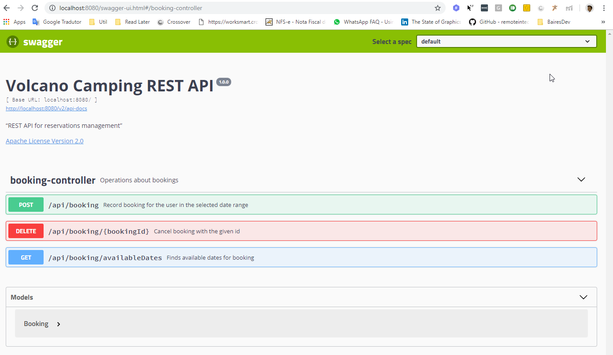
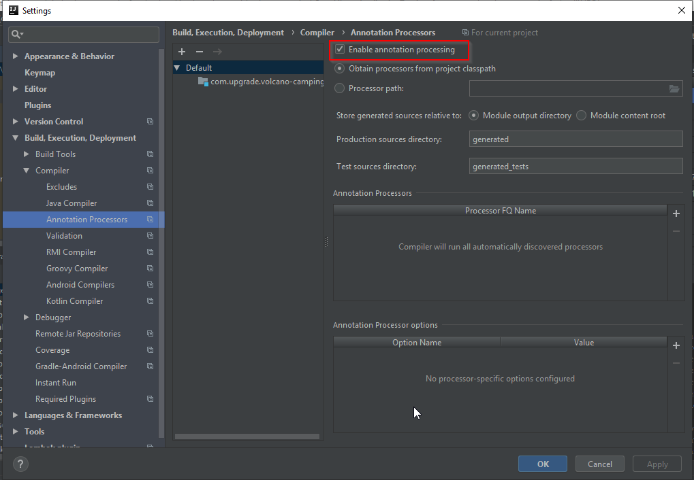

# volcano-camping

## Problem Statement ##

An underwater volcano formed a new small island in the Pacific Ocean last month. All the conditions on the island seems perfect and it was decided to open it up for the general public to experience the pristine uncharted territory.

The island is big enough to host a single campsite so everybody is very excited to visit. In order to regulate the number of people on the island, it was decided to come up with an online web application to manage the reservations. You are responsible for design and development of a REST API service that will manage the campsite reservations.

To streamline the reservations a few constraints need to be in place 


- The campsite will be free for all.
- The campsite can be reserved for max 3 days.
- The campsite can be reserved minimum 1 day(s) ahead of arrival and up to 1 month in advance.
- Reservations can be cancelled anytime.

For sake of simplicity assume the check-in & check-out time is 12:00 AM

### System Requirements ###
- The users will need to find out when the campsite is available. So the system should expose an API to provide information of the availability of the campsite for a given date range with the default being 1 month.
- Provide an end point for reserving the campsite. The user will provide his/her email & full name at the time of reserving the campsite along with intended arrival date and departure date. Return a unique booking identifier back to the caller if the reservation is successful.
- The unique booking identifier can be used to modify or cancel the reservation later on. Provide appropriate end point(s) to allow modification/cancellation of an existing reservation
- Due to the popularity of the island, there is a high likelihood of multiple users attempting to reserve the campsite for the same/overlapping date(s). Demonstrate with appropriate test cases that the system can gracefully handle concurrent requests to reserve the campsite.
- Provide appropriate error messages to the caller to indicate the error cases.
- In general, the system should be able to handle large volume of requests for getting the campsite availability.
- There are no restrictions on how reservations are stored as as long as system constraints are not violated.

## Documentation ##
A complete documentation of the endpoints is available at the  [file](./docs/api-doc.pdf) 

## Solution ##

### REST API ###
For the REST API a spring-boot application was build with all the endpoints specified on the problem statement. All records are being persisted on a MySQL database that can be configured on ./src/main/resources/application.properties.

To check all the endpoints and trigger some requests against the API please check the following url:
```
[protocol]://[host]:[port]/swagger-ui.html
```

For example: http://localhost:8080/swagger-ui.html

A screen with all the endpoints will be shown, just like the picture above:




### Unit Testing ###
All the tests are executed in junit tests under ./src/test folder. Their execution does not impact the database since they are being executed under an in-memory datastorage.

### Build and Dependency management Tool ###
For managing the dependencies and build the application distributable file we are using gradle in version 5.2.

To build the app the machine should have java 8 or later version and version 5.2 of gradle. To build the app please clone this repo and under the root folder type the following command:
```
gradle build
```

This will run all unit tests and build the jar file that runs it.

To run the solution directly from gradle:
```
gradle bootRun
```

To build the executable jar to run the solution without gradle

```
gradle build bootJar
```
This will generate a jar file under build/libs folder


## Import the project into IDE ##
This project uses lombok plugin to reduce the boilerplate code. To import it successfully on your favorite IDE you'll need to add the lombok plugin, eighter on Eclipse or Intellij IDEA. 

It's necessary to enable Annotation Processing, just as the example above in Intellij IDEA:




